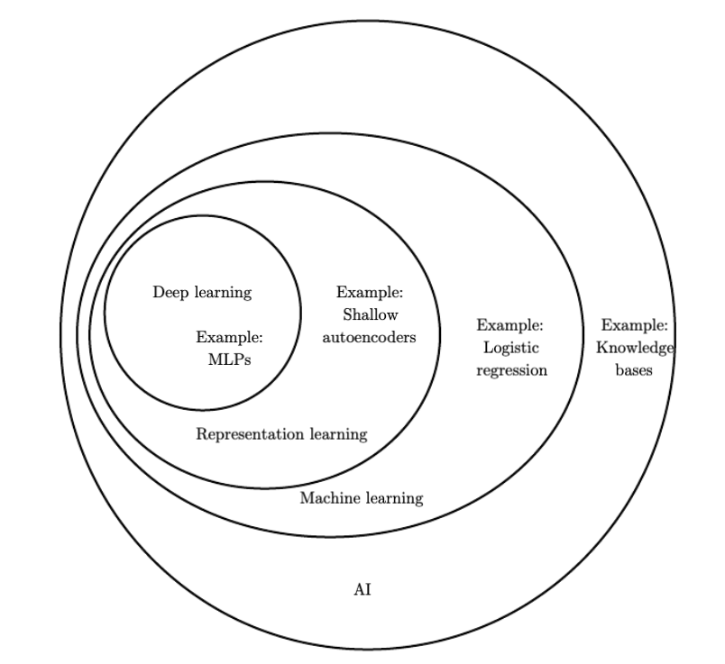

# Session 6: Neural Networks

This course is interesting because it brings together two incredibly complex and
rapidly-advancing topics: digital design and machine learning. Now that we've
wrapped our heads around a few core concepts in the former space, we're ready to
see how to apply our skills to a novel scenario.

Let's first remind ourselves of our goal: building an inference accelerator on
an FPGA. But what exactly are we going to accelerate?

## Deep learning

Deep learning is subcategory in the domain of machine learning, which is itself
a subcategory of the field of artificial intelligence. It gains its name from
the fact that information travels several layers deep through an arrangement of
so-called neurons. It is simply one of many approaches to AI but it is also one
that has received tremendous attention in the past decade, in part due to its
excellent accuracy.

   
*Figure taken from https://www.deeplearningbook.org/contents/intro.html

## Network topologies

The quintessential example of a deep learning model is the feedforward deep
network, or multilayer perceptron (MLP). This is also called a fully connected
network.

   
*Figure taken from http://neuralnetworksanddeeplearning.com

A few observations:

- Information travels from left to right
- All neurons in one layer are connected to all neurons in the next
- There is one input and one output layer as well several intermediate "hidden"
  layers

Another kind of neural network is a convolutional network. We're going to be
building one of these. They're known for their high accuracy with image inputs
due to their awareness of spatial features.

   
*Figure taken from http://neuralnetworksanddeeplearning.com

The basic structure is as follows:

1. Information resident in the 28x28 grid gets gradually reduced to the last
   output layer with 10 neurons.
2. The middle layer is called the convolutional layer and is formed of several
   _feature maps_.
3. Each feature map is then turned into a unit in the pooling layer.
4. Finally, all neurons in the pooling layer are connected to all 10 neurons in
   the output layer, reminiscent of our fully-connected network.

The 'convolution' in the name comes from the fact that the initial operation
applied to the image to obtain the feature maps is known as a
[convolution](https://mathworld.wolfram.com/Convolution.html).

> [!NOTE]
>
> We could, of course, train an MLP and use it for inference. For our relatively
> well-scoped problem of digit recognition on a 28x28 grid of greyscale pixels,
> both approaches would work well. That said, MLPs are considered 'old
> technology', having been around for decades before CNNs and are rarely used
> for image recognition. CNNs themselves were introduced in a seminal paper by
> LeCun and others in 1998!

## Training and inference

Machine learning is a two-step process.

> [!TIP]
>
> I've found that neural networks can be somewhat of a misnomer. You can draw an
> equivalence between human neurons firing and being interconnected in a complex
> web but that's pretty much where the analogy stops. I'd therefore encourage
> you to think more in terms of 'nodes' or 'units' and as the whole system being
> just a function.
